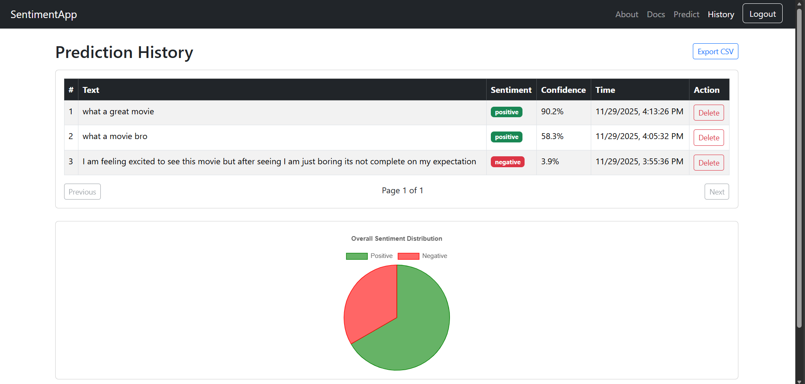

# Fullstack ML Sentiment Analysis App 🎯

## Overview
A full‑stack machine learning application built with **FastAPI**, **PostgreSQL**, and **React**.  
It integrates a trained **Recurrent Neural Network (RNN)** model for text sentiment classification and provides a polished web interface with authentication, prediction history, charts, and export features.

This project demonstrates end‑to‑end skills in **machine learning, backend development, and frontend development**.

---

## Features
- 🔑 **User Authentication** (JWT tokens for register/login)
- 📝 **Sentiment Prediction** of text using an RNN model
- 📊 **History Management** (view, delete, pagination, CSV export)
- 🎨 **Interactive Charts** for sentiment distribution
- 📄 **Documentation Page** explaining architecture, setup, and usage

---

## Tech Stack
- **Backend**: FastAPI, SQLAlchemy, PostgreSQL
- **Frontend**: React, Bootstrap
- **Machine Learning**: RNN (NLP sentiment analysis)
- **Scripts**: Unified `start.sh` for backend + frontend

---

## Folder Structure
Recurrent Neural Network/ 
  ├── backend/              # FastAPI backend with auth, prediction, database 
  ├── data/                 # Training/test data 
  ├── model/                # Trained RNN model files 
  ├── sentiment-frontend/   # React + Bootstrap frontend 
  ├── start.sh              # Unified script to launch backend + fronten

---

## Run Locally

### 1. Clone the repository
```bash
git clone https://github.com/datadreamsbyasghar/fullstack-ml-sentiment-.git
cd fullstack-ml-sentiment-

---

## Install dependencies

- ### Backend:
cd backend
pip install -r requirements.txt
cd ..

---

- ### Frontend:
```bash
cd sentiment-frontend
npm install
cd ..

---

## Start both servers with one command
```bash
./start.sh
---

## Screenshot

## Screenshots



---

 ## License 

 Under MIT License

 ---